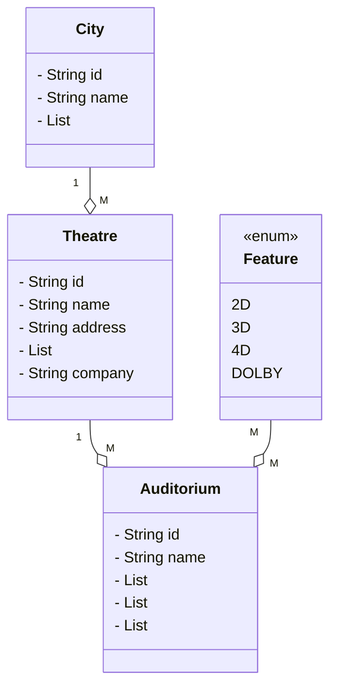
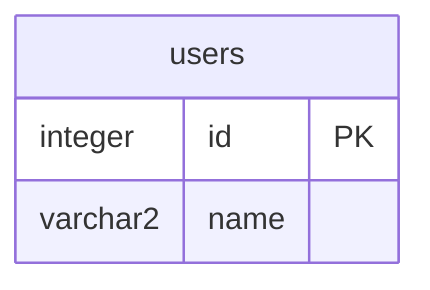

# Online Ticket Booking System

### An online platform to book movie ticket across various cities and theatres

## Requirements

* A user can Log-in and select a City.
* After selecting a city, the user will be provided with a list of Theatres.
* A Theatre can be a single or multiple auditoriums.
* Each Auditorium will have a siting capacity.
* Each auditorium will have set of features.

